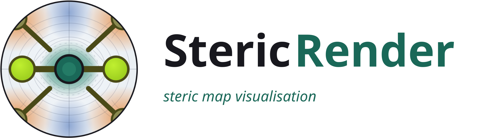
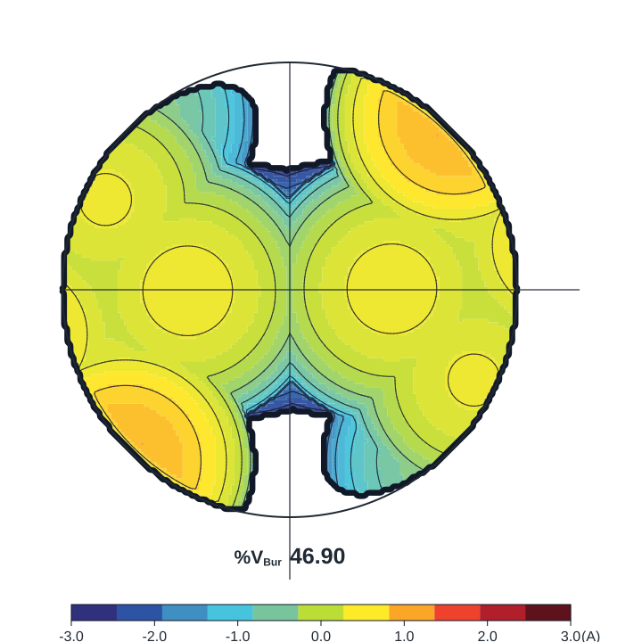

<p align="center">
  
</p>

___

Steric maps and buried-volume figures, oriented with `xyzrender`.

| Overlay | Steric map |
|---|---|
|  |  |

## Gallery

All examples are generated from the ACS SambVca SI multi-XYZ file. `[ref]`
marks cases with a published `%VBur` value used as a numeric check.

```bash
python scripts/run_examples.py --with-overlay --output-dir examples/images/sambvca
```

### Monocoordinated Ligands

| PCy3 [ref] | NHC-Ni | NHC-Ir |
|---|---|---|
|  |  |  |

### Dicoordinated Ligands

| MeDuPhos | Box [ref] | Diphosphine |
|---|---|---|
|  |  |  |

| PHOX | Xantphos | Diimine |
|---|---|---|
|  |  |  |

| TADDOL | BINOL | Bipy |
|---|---|---|
|  |  |  |

### Tetracoordinated Ligands

| Salen-Mn [ref] | Chiral salen-Mn [ref] | Zr-ONNO [ref] |
|---|---|---|
|  |  |  |

### Zirconocenes

| C2 zirconocene | Substituted zirconocene | Cs zirconocene |
|---|---|---|
|  |  |  |

## CLI

```bash
stericrender map complex.xyz \
  --center 1 \
  --axis 2,3 \
  --exclude 1 \
  --flip-z \
  --config flat \
  --overlay-opacity 0.72 \
  --map-palette sambvca \
  --color-range -3 3 \
  --output-prefix results/complex
```

Radius and zoom examples:

```bash
# Increase the analytical steric-map sphere radius.
stericrender map complex.xyz --center 1 --axis 2,3 --exclude 1 --radius 4.5

# Zoom the overlay out while keeping the steric-map radius unchanged.
stericrender map complex.xyz --center 1 --axis 2,3 --exclude 1 --zoom 1.6

# Combine a larger steric-map radius with a wider overlay view.
stericrender map complex.xyz --center 1 --axis 2,3 --exclude 1 --radius 4.5 --zoom 1.6
```

Outputs:

```text
results/complex.json
results/complex_grid.csv
results/complex_grid.npz
results/complex_map.svg
results/complex_overlay.svg
results/complex_oriented.xyz
```

Useful flags: `--include`, `--exclude`, `--frames`, `--radii`,
`--include-hydrogens`, `--sphere-radius`/`--radius`, `--mesh`, `--visual-mesh`,
`--config`, `--overlay-opacity`, `--overlay-all-atoms`, `--zoom`,
`--no-contours`, `--no-colorbar`, `--show-quadrants`, `--no-overlay`.
